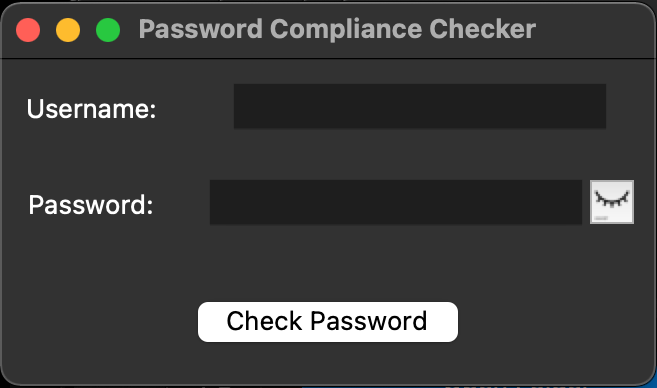
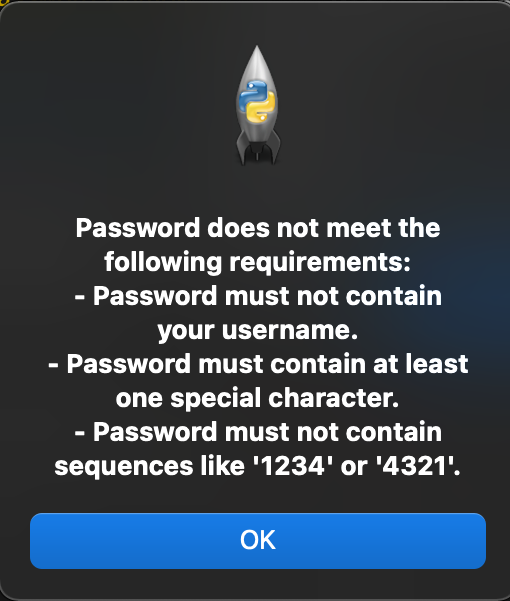

# Password Compliance Checker

## Description
Ensure your passwords are up to the mark with Password Compliance Checker! This Python-based GUI application scrutinizes your passwords for complexity, including length, digit inclusion, special characters, and avoidance of common patterns, providing you with instant feedback to enhance your security.

## Table of Contents
- [Features](#features)
- [Installation](#installation)
- [Usage](#usage)
- [Configuration](#configuration)
- [License](#license)

## Features
- Validates passwords against a comprehensive set of criteria.
- Provides actionalble feedback on required complexity criteria.
- Compatible with multiple operating systems.
- Toggle feature to show or hide the password while typing.
- GUI for simple interaction.
- Checks for:
    - Usage of U.S. state names, case insensitive
    - Minimum password length, customizable value
    - Diversity in character casing
    - Inclusion of numeric digit(s)
    - Inclusion of special character(s)
    - Commonly used passwords (e.g., "password", "123456")
    - Sequential digit patterns such as "1234" or "4321"
    - Repeated sequences of characters (e.g., "aaaa")
    - (Optional) Usage of provided username in password

## Installation
- Install the required library: [requirements.txt](https://github.com/carlosramireznycla/Password-Strength-Checker/blob/main/requirements.txt)

## Usage
1. From your terminal, run "Password Compliance Check.py"
```bash
python3 Password\ Compliance\ Check.py 
```
2. (Optional) Enter username
3. Enter a password in the entry field and click "Check Password".
4. (Optional) You can click the eye icon to display the text.
5. Result will display in a pop-up window below.



## License
This project is licensed under the MIT License. See the [LICENSE](https://github.com/carlosramireznycla/Password-Strength-Checker/blob/main/LICENSE) file for details.